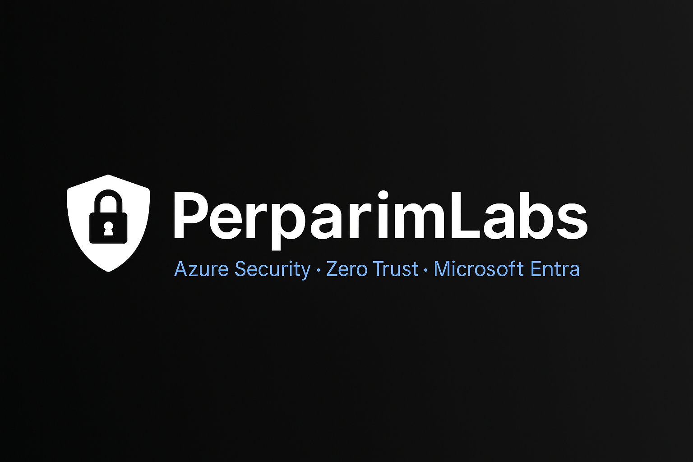
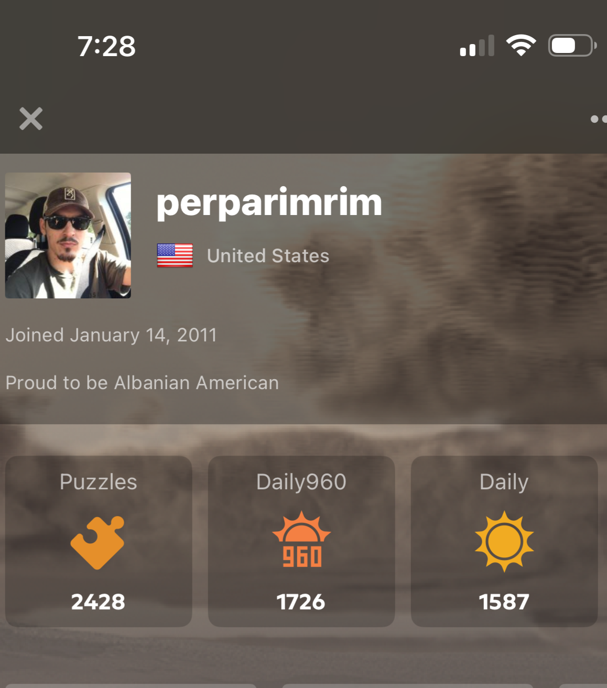

  

Real-world Azure Security, Zero Trust, and Microsoft Entra projects — built and shared for the cloud community.

# 👋 Welcome to PerparimLabs

I’m **Perparim Abdullahu**, founder of **#PerparimLabs**, a Microsoft Certified Azure Solutions Architect Expert specializing in **Cloud Security, Identity Governance, and Zero Trust Architecture**.  
This portfolio showcases my **hands-on labs** and **real-world architecture projects** built to solve modern enterprise challenges in **Azure, Microsoft Entra, and Microsoft Security**.

---

## 📂 Explore My Work

- **[Labs](https://perparimlabs.github.io/labs/)** – Step-by-step demonstrations covering Azure, Microsoft Entra, and Security scenarios, designed to be clear, practical, and interview-ready.
- **[Projects](https://perparimlabs.github.io/projects/)** – End-to-end real-world Azure and Security architecture projects with diagrams, strategies, and technical documentation.

---

💡 *Each item is created under the **#PerparimLabs** brand and includes context, technical breakdowns, and visuals to help you see exactly how the solution works.*

---

### 📌 Footer
© **#PerparimLabs** – Built with passion for **Azure, Microsoft Security, and the Cloud Community**.  
Connect with me on [LinkedIn](https://www.linkedin.com/in/perparim-abdullahu-2b0530324) | Explore more at [GitHub Pages](https://perparimlabs.github.io)
  
I share hands-on labs, architecture breakdowns, and Zero Trust strategies using:

- ☁ **Microsoft Entra ID**
- 🔐 **Conditional Access & Identity Protection**
- 🛡 **Microsoft Defender for Cloud**
- 🔄 **Hybrid Identity & Entra Connect**
- 📊 **Microsoft Sentinel (SIEM & SOAR)**
- 🧵 LinkedIn carousel breakdowns

📍 Based in Louisville, KY (US)  
🔗 Connect with me on **[LinkedIn](https://www.linkedin.com/in/perparim-abdullahu-2b0530324/)**  
🎓 SC-100 in progress | Microsoft Certified: SC-300, AZ-305, AZ-104

---

**14 Years of Strategy — From Chessboard to Cloud**  
From competing on chess.com since 2011 to securing cloud identities, workloads, and data.  
The mindset never changed: think ahead, control the board, protect what matters.

---

## 📂 Labs

Hands-on technical labs demonstrating:

- Microsoft Entra ID  
- Conditional Access & Identity Protection  
- Microsoft Defender for Cloud  
- Hybrid Identity & Entra Connect  
- Microsoft Sentinel & Intune  

- 🖥 [Deploy Microsoft Global Secure Access Client (PDF)](https://perparimlabs.github.io/labs/deploy-global-secure-access-client.pdf)  
- 🖥 [Lab Demo – Integrating On-Prem AD with Microsoft 365 Domain Sync (PDF)](https://perparimlabs.github.io/labs/demo-integrate-onprem-entra365-sync.pdf)  
- 🗒 [Lab Clean Before You Sync – Hybrid Identity Checklist (PDF)](https://perparimlabs.github.io/labs/Clean%20Before%20You%20Syn%20-%20Real-World%20Checklist%20for%20Hybrid%20Identity.pdf)  
- 📑 [Lab Hybrid Identity – Choosing the Right Authentication Method (PDF)](https://perparimlabs.github.io/labs/hybrid-identity-right-authentication-method.pdf)  
- 🗂 [Lab Planning Your First Hybrid Identity Sync (PDF)](labs/plan-first-hybrid-identity-sync.pdf)
- 🔄 [Lab Microsoft Entra Connect vs. Cloud Sync – What’s the Difference (PDF)](https://perparimlabs.github.io/labs/entra-connect-vs-cloud-sync.pdf)  
- 🔐 [Advanced Identity Protection in Microsoft Entra ID (PDF)](https://perparimlabs.github.io/labs/advanced-identity-protection-entra-id.pdf)  
- ⚠ [Why We Replace Security Defaults with Conditional Access (PDF)](https://perparimlabs.github.io/labs/replace-security-defaults-conditional-access.pdf)  
- 🛡 [Manage Access to Enterprise Applications in Microsoft Entra (PDF)](https://perparimlabs.github.io/labs/manage-access-enterprise-apps.pdf)  
- 🛠 [Troubleshooting Microsoft Entra Connect Health Sync Error (PDF)](https://perparimlabs.github.io/labs/troubleshoot-entra-connect-health.pdf)  
- 🔏 [Lab Enable and Test MFA in Microsoft Entra ID (PDF)](https://perparimlabs.github.io/labs/enable-test-mfa-entra-id.pdf)  
- 🔐 [Lab Enforce MFA for Specific App – Entra ID (PDF)](https://perparimlabs.github.io/labs/Lab-Enforce-MFA-for-Specific-App---Entra-ID.pdf)  
- 🗝 [Lab Choosing the Right Azure AD Authentication Method (PDF)](https://perparimlabs.github.io/labs/Choosing-the-Right-AzureAD-Authentication-Method.pdf)  
- 🛡 [Lab Microsoft Entra ID Protection – User Risk Policy (PDF)](https://perparimlabs.github.io/labs/Entra-ID-Protection-User-Risk-Policy-Demo.pdf)  
- 🔄 [Lab Microsoft Entra Connect – Hybrid Identity Sync (PDF)](https://perparimlabs.github.io/labs/Microsoft-Entra-Connect-Hybrid-Identity-Sync.pdf)  
- 🔐 [Secure Remote Access with Entra App Proxy (PDF)](https://perparimlabs.github.io/labs/secure-remote-access-app-proxy.pdf)  
- 🛡 [Protecting Identities with Microsoft Entra ID Protection (PDF)](https://perparimlabs.github.io/labs/entra-id-protection-identities.pdf)  
- 🗂 [Custom Azure RBAC Role for Key Vault Secrets Access (PDF)](https://perparimlabs.github.io/labs/custom-rbac-keyvault-access.pdf)  
- 🔐 [Secure Azure Access Using Managed Identity (PDF)](https://perparimlabs.github.io/labs/secure-azure-access-managed-identity.pdf)  
- 🌐 [End-to-End SaaS Application Management in Microsoft Entra (PDF)](https://perparimlabs.github.io/labs/end-to-end-saas-management-entra.pdf)  
- 🛡 [Secure Your SaaS with Microsoft Defender for Cloud Apps (PDF)](https://perparimlabs.github.io/labs/Secure-Your-SaaS-with-Microsoft-Defender-for-Cloud-Apps.pdf)  
- 🔍 [Discover What Your Users Are Really Doing in the Cloud (PDF)](https://perparimlabs.github.io/labs/discover-what-your-users-are-really-doing-in-the-cloud.pdf)  
- 🛡 [Real-Time SaaS Threat Protection with Microsoft Defender for Cloud Apps (PDF)](https://perparimlabs.github.io/labs/real-time-saas-threat-protection-with-microsoft-defender-for-cloud-app.pdf)  
- 🎯 [Mastering Identity Governance with Microsoft Entra (PDF)](https://perparimlabs.github.io/labs/mastering-identity-governance-entra.pdf)  
- 🧹 [Clean Up Guest Access with Microsoft Entra Access Reviews (PDF)](https://perparimlabs.github.io/labs/clean-up-guest-access-entra.pdf)  
- 🔐 [Grant Just-in-Time Admin Access with Microsoft Entra PIM (PDF)](https://perparimlabs.github.io/labs/grant-jit-access-pim.pdf)  
- 🚨 [Never Get Locked Out: Create a Break Glass Admin Account (PDF)](https://perparimlabs.github.io/labs/never-get-locked-out-break-glass-admin.pdf)  
- 🔍 [Monitor Sign-Ins and Admin Activity in Microsoft Entra ID (PDF)](https://perparimlabs.github.io/labs/monitor-sign-ins-admin-activity-entra.pdf)  
- 🛡 [Get Proactive with Microsoft Sentinel (PDF)](https://perparimlabs.github.io/labs/get-proactive-with-microsoft-sentinel.pdf)  
- 📊 [Set Up Microsoft Sentinel + Log Analytics (PDF)](https://perparimlabs.github.io/labs/set-up-microsoft-sentinel-log-analytics.pdf)  
- 🔄 [Migrate from Legacy MFA & SSPR to Microsoft Entra Authentication Methods (PDF)](https://perparimlabs.github.io/labs/migrate-from-legacy-mfa-sspr-entra-authentication-methods.pdf)  
- [Azure Backup & Recovery Lab (PDF)](https://perparimlabs.github.io/labs/Azure-Backup-Recovery.pdf)  
*Configured Azure Backup vaults and tested VM recovery for business continuity.*
- [Patch Management with Azure Update Management (PDF)](https://perparimlabs.github.io/labs/Azure-Update-Management.pdf)  
*Implemented update management for Windows VMs, automating security patching and compliance reporting.*
- [Enabling Microsoft Purview Auditing Permissions Plus Setup](https://perparimlabs.github.io/labs/Enabling-Microsoft-Purview-Auditing-Permissions-Plus-Setup.pdf)
- [Build the Log Analytics Workspace](https://perparimlabs.github.io/labs/Build-Log-Analytics-Workspace.pdf)
- [Build your first Analytics Rule in Microsoft Sentinel](https://perparimlabs.github.io/labs/Build-Your-First-Analytics-Rule-in-Microsoft-Sentinel.pdf)
- [Build an NRT (Near-real time) Analytics Rule](https://perparimlabs.github.io/labs/Build-an-NRT-Analytics-Rule.pdf)
- [Automating incident Response in Microsoft Sentinel](https://perparimlabs.github.io/labs/Automationg-Incident-Response-in-Microsoft-Sentinel.pdf)
- [Threat Hunting in Microsoft Sentinel](https://perparimlabs.github.io/labs/Threat-Hunting-in-Microsoft-Sentinel.pdf)
- [Detecting and Responding to Identity Risks with Microsoft Entra ID](https://perparimlabs.github.io/labs/Detecting-and-Responding-to-Indentity-Risk-with-Microsoft-EntraID.pdf)
- [Automate Microsoft Defender for Cloud Alert with Logic App](https://perparimlabs.github.io/labs/Automate-Microsoft-Defender-for-Cloud-Alert-with-Logic-App.pdf)
- [Automate Microsoft Defender for Cloud (Part 2)](https://perparimlabs.github.io/labs/Automate-Microsoft-Defender-for-Cloud-(Part2).pdf)

---

## 📂 Projects

Real-world Azure & Entra architecture breakdowns, Zero Trust strategies, and carousel posts adapted for long-form reading.

- 🏗 [Architect a Secure, Scalable Azure Landing Zone for Enterprise Migration](https://perparimlabs.github.io/projects/architect-a-secure-scalable-azure-landing-zone-for-enterprise-migration.pdf)  
- 🔐 [Secure Access with Microsoft Entra: Zero Trust in Action](https://perparimlabs.github.io/projects/secure-access-entra-zero-trust.pdf)  
- 🛡 [Architecting Zero Trust in Azure: Real-World Scenario for Secure Access & Device Protection](https://perparimlabs.github.io/projects/Architecting-Zero-Trust-Azure-ZT-Real-World.pdf)  
- 📄 [Microsoft Entra Connect Lab (PDF)](https://perparimlabs.github.io/projects/Microsoft%20Entra%20Connect%20Lab.pdf) | [Project Overview (MD)](https://perparimlabs.github.io/projects/Microsoft%20Entra%20Connect%20Lab.md)  
- 🛠 [Troubleshooting Microsoft Entra Connect Health Sync Error (PDF)](https://perparimlabs.github.io/projects/Troubleshooting_Entra_Connect_Health_Sync_Error.pdf)  
- 🔐 [Advanced Identity Protection in Microsoft Entra ID (PDF)](https://perparimlabs.github.io/projects/advanced-identity-protection-entra-id.pdf)  
- 🎯 [Mastering Identity Governance with Microsoft Entra](https://perparimlabs.github.io/projects/mastering-identity-governance-entra.pdf)  
- 🧹 [Clean Up Guest Access with Microsoft Entra Access Reviews](https://perparimlabs.github.io/projects/clean-up-guest-access-entra.pdf)  
- 🔐 [Grant Just-in-Time Admin Access with Microsoft Entra PIM](https://perparimlabs.github.io/projects/grant-jit-access-pim.pdf)  
- 🚨 [Never Get Locked Out: Create a Break Glass Admin Account](https://perparimlabs.github.io/projects/never-get-locked-out-break-glass-admin.pdf)  
- 🔍 [Monitor Sign-Ins and Admin Activity in Microsoft Entra ID](https://perparimlabs.github.io/projects/monitor-sign-ins-admin-activity-entra.pdf)  
- 🛡 [Get Proactive with Microsoft Sentinel](https://perparimlabs.github.io/projects/get-proactive-with-microsoft-sentinel.pdf)  
- 📊 [Set Up Microsoft Sentinel + Log Analytics](https://perparimlabs.github.io/projects/set-up-microsoft-sentinel-log-analytics.pdf)  
- 🏢 [Architecting Business Resilience in Azure & Microsoft 365](https://perparimlabs.github.io/projects/architecting-business-resilience.pdf)  
- 🔒 [Designing a Ransomware Resilience Strategy in Azure & Microsoft 365](https://perparimlabs.github.io/projects/designing-a-ransomware-resilience-stragegy.pdf)  
- 🛡 [Ransomware Defense Strategy: A Zero Trust & Microsoft Security Approach](https://perparimlabs.github.io/projects/ransomware-defense-strategy-zero-trust-and-microsoft-security.pdf)  
- [Zero Trust: Core Capabilities & Controls (PDF)](https://perparimlabs.github.io/projects/ZeroTrust-Core-Capabilities-Controls.pdf)  
*Designed a Zero Trust security framework showcasing Microsoft’s core capabilities and controls for enterprises.*
- [Microsoft 365 Defender: Protecting Against Insider & External Attacks](https://perparimlabs.github.io/projects/microsoft-365-defender-insider-external-attacks.pdf)
- 🛡️ [Navigating Microsoft Defender & Purview with Insider Risk Management](https://perparimlabs.github.io/projects/Defender-Purview-IRM-Lab.pdf)
- [Deep Dive Insider Risk Management in Microsoft Purview](https://perparimlabs.github.io/projects/Insider-Risk-Management-Purview.pdf)
- 🛡 [Zero Trust Rapid Modernization Plan (RaMP)](https://perparimlabs.github.io/projects/Zero-Trust-Rapid-Modernization-Plan.pdf)
- 🔒 [Secure Cloud Adoption with Microsoft CAF](https://perparimlabs.github.io/projects/Secure-Cloud-Adoption-with-Microsoft-CAF.pdf)
- [Applying the Azure Well-Architected Framework for Secure Cloud governance](https://perparimlabs.github.io/projects/applying-azure-well-architected-framwork-for-secure-cloud-governance.pdf)
- [Implementing Security & Governance with Azure Landing Zones](https://perparimlabs.github.io/projects/Implementing-Security-And-Governance-with-Azure-Landing-Zones.pdf)
- [Security Operations in Hybrid & Multi-Cloud Encironments](https://perparimlabs.github.io/projects/Security-Operations-in-Hybrid-And-Multi-Cloud-Environments.pdf)
- [What is Extanded Detection and Response (XDR)](https://perparimlabs.github.io/projects/What-is-Extended-Detection-and-Response-(XDR).pdf)
- [What is Microsoft Sentinel (SIEM & SOAR)](https://perparimlabs.github.io/projects/What-is-Microsoft-Sentinel-(SIEM&SOAR).pdf)
- [Mapping Threates with MITRA ATT&CK in](https://perparimlabs.github.io/projects/Mapping-Threats-with-MITRE-ATT&CK-in.pdf)
- [Investigating Identity Risks with Microsoft 365 Defender](https://perparimlabs.github.io/projects/Investigating-Identity-Risks-with-Microsoft-365-Defender.pdf)
- [Understanding Roles & Permisions in Microsoft Sentinel](https://perparimlabs.github.io/projects/Understanding-Roles&Permissions-in-Microsoft-Sentinel.pdf)

---

  

