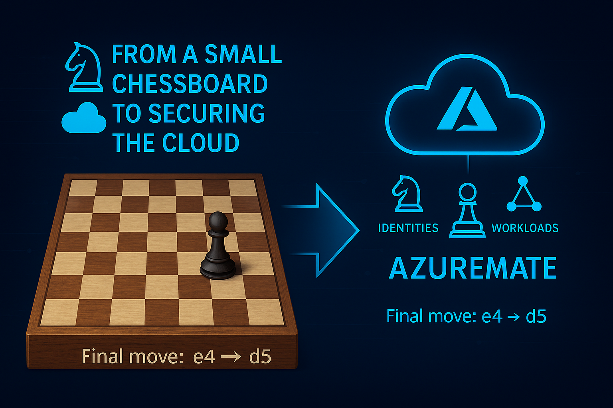

# Projects

Real-world Azure & Entra architecture breakdowns, Zero Trust strategies, and carousel posts adapted for long-form reading.

# From Chessboard to AzureMate ♟️ ☁️

From a small wooden chessboard with my dad to securing identities, data, and workloads in Azure —  
the game stayed the same: think ahead, control the board, protect what matters.  
Victory belongs to the prepared.

**Final move:** `e4 → d5 → AzureMate`

---

**Since 2011 – Always up for a challenge**  

  🔗 **Portfolio:** [https://perparimlabs.github.io](https://perparimlabs.github.io)

-🏗️[ Architect a Secure, Scalable Azure Landing Zone for Enterprise Migration](architect-a-secure-scalable-azure-landing-zone-for-enterprise-migration.pdf)
- 🛡️[ Secure Access with Microsoft Entra: Zero Trust in Action](secure-access-entra-zero-trust.pdf)
- 🧰[ Architecting Zero Trust in Azure: Real-World Scenario for Secure Access & Device Protection](Architecting-Zero-Trust-Azure-ZT-Real-World.pdf)
- 📘 [Microsoft Entra Connect Lab (PDF)](Microsoft%20Entra%20Connect%20Lab.pdf) | [Project Overview (MD)](Microsoft%20Entra%20Connect%20Lab.md)
- 🛠 [Troubleshooting Microsoft Entra Connect Health Sync Error (PDF)](Troubleshooting_Entra_Connect_Health_Sync_Error.pdf)
- 🔐 [Advanced Identity Protection in Microsoft Entra ID (PDF)](advanced-identity-protection-entra-id.pdf)
- 🎯 [Mastering Identity Governance with Microsoft Entra](mastering-identity-governance-entra.pdf)
- [Clean Up Guest Access with Microsoft Entra Access Reviews](clean-up-guest-access-entra.pdf)
- [Grant Just-in-Time Admin Access with Microsoft Entra PIM](grant-jit-access-pim.pdf)
- 🚨[ Never Get Locked Out: Create a Break Glass Admin Account](never-get-locked-out-break-glass-admin.pdf)
- 🔍[ Monitor Sign-Ins and Admin Activity in Microsoft Entra ID](monitor-sign-ins-admin-activity-entra.pdf)
- 🛡️[ Get Proactive with Microsoft Sentinel](get-proactive-with-microsoft-sentinel.pdf)
- 🛡️[ Set Up Microsoft Sentinel + Log Analytics](set-up-microsoft-sentinel-log-analytics.pdf)
- 📊[ Architecting Business Resilience in Azure & Microsoft 365](architecting-business-resilience.pdf)
- 🔐 [Designing a Ransomware Resilience Strategy in Azure & Microsoft 365](designing-a-ransomware-resilience-stragegy.pdf)
- 🚨 [Ransomware Defense Strategy: A Zero Trust & Microsoft Security Approach](ransomware-defense-strategy-zero-trust-and-microsoft-security.pdf)
- [ZeroTrust Core Capabilities & Controls (PDF)](ZeroTrust-Core-Capabilities-Controls.pdf)
[Microsoft 365 Defender: Protecting Against Insider & External Attacks](./projects/microsoft-365-defender-insider-external-attacks.pdf)

---

© **#PerparimLabs** – Built with passion for **Azure, Microsoft Security, and the Cloud Community**.  
Connect with me on [LinkedIn](https://www.linkedin.com/in/perparim-abdullahu-2b0530324) | Explore more at [GitHub Pages](https://perparimlabs.github.io)
